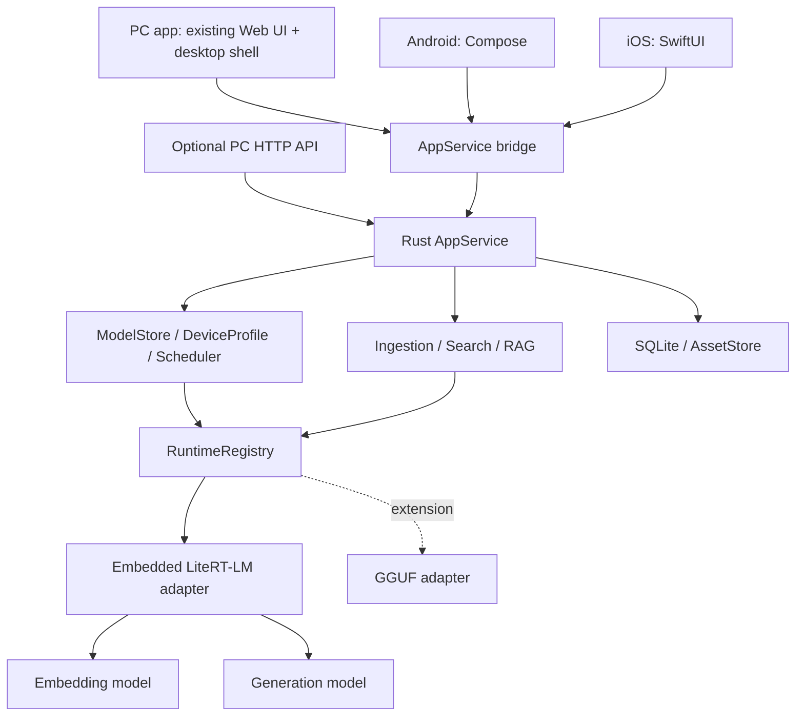

# mj-llm architecture

[한국어](architecture.md) | [English](architecture.en.md) | [日本語](architecture.ja.md)

> Documentation translation, synchronized with the source on 2026-10-08. Commands, pinned identifiers, and implementation/verification status are preserved.

> Written: 2026-10-08. Status: product design plus an implemented N0 macOS CPU adapter and real smoke verification. The full product is not implemented.
> This is the design source for mj-llm. For older work tables referring to existing-project paths, see [separation boundaries](project-separation.en.md).

## 1. Decisions, assumptions, and completed scope

| Category | Content |
|---|---|
| User-confirmed requirements | Inherit ongoing work; standalone execution on all major platforms; multimodal product without Ollama |
| Design decisions | Shared Rust application core, embedded LiteRT-LM first, platform packages, separate retrieval/generation models |
| Default assumptions | Personal/local first; initial document/photo search and grounded chat; Korean quality validation first |
| Extensions | Audio/video search, additional models, MCP, Trusted Node, optional project transfer |
| Unresolved | Minimum OS/device, codecs, native artifact revision, distribution channels, cross-device synchronization requirements |

One product does not mean one binary or identical GPU implementations on every device. Share domain/storage rules and API semantics while building OS-specific applications and accelerators. Core functions work offline after initial model download. An offline initial installation offers verified local-model import or indicates that downloading is required.

Version one requires no automatic device sync, accounts, or cloud. PCs and phones may have independent projects. Manual project export/import arrives in N4; importing legacy JSON conversations is required in N1.

Required platforms are Windows/macOS/Linux/Android/iOS/iPadOS. Follow the [product platform table](product-plan.en.md) for baseline architectures and extra candidates. Browser-only execution is assumed to be a later candidate. Distinguish the N1 PC preview from the N2 all-platform general release.

## 2. Official support evidence and adoption conditions

Checked on 2026-10-08. Upstream support below is separate from implementation/verification in this project.

| Evidence | Observed fact | Design implication |
|---|---|---|
| [LiteRT-LM overview](https://developers.google.com/edge/litert-lm/overview) | Lists PC/Android/iOS and EmbeddingGemma 2; Swift is Early Preview | Primary common-engine candidate; gates per OS/SDK/accelerator |
| [Embedding API](https://developers.google.com/edge/litert-lm/embedding_models) | Python/Kotlin/Swift/JS examples and multimodal embedding interface | Validate an embedded SDK without a mobile Python service |
| [C++ API](https://developers.google.com/edge/litert-lm/cpp) | Engine, conversation, asynchronous callbacks, multimodal content | C bridge so Rust does not depend directly on the C++ ABI |
| [Swift API](https://developers.google.com/edge/litert-lm/swift) | Apple SDK and Metal path | First iOS native-bridge candidate |
| [EmbeddingGemma 2 card](https://huggingface.co/google/embeddinggemma-2) | Text/image/audio/video embeddings, MRL, precision caveats | Retrieval model; distinguish from answer generation and ASR/OCR |
| [Text-vision artifact](https://huggingface.co/litert-community/embeddinggemma-2-text-vision-440m-litert-lm) | Text/image distribution candidate | N0/N1 default candidate; verify file/revision/hash before adoption |
| [Full-modality artifact](https://huggingface.co/litert-community/embeddinggemma-2-740m-litert-lm) | Full-input distribution candidate | N3 candidate; do not infer runtime RAM from download size |
| [llama.cpp support change](https://github.com/ggml-org/llama.cpp/pull/30054) | EmbeddingGemma 2 support merged | Optional alternative; endpoints and individual modalities need separate execution tests |

LiteRT embedding examples and the Hugging Face card use different task prefixes. Do not mix strings from `latest` documentation. N0 must compare pinned metadata, SDK preprocessing, and official tests, establish a canonical form, and freeze golden fixtures. Do not copy current Python text prefixes into the native path before verification.

## 3. App, core, and runtime responsibilities



- The initial PC shell candidate is Tauri-family software accommodating existing HTML/JS. Pin its version after N0 verifies IPC, file picking, native-library packaging, signing, and updates. Existing Web UI does not count as completed native mobile support.
- `AppService` owns commands, progress events, and cancellation without HTTP types or UI-framework references. Compare UniFFI-family bridges with a narrow C ABI in N0 and pin one mobile bridge.
- PC uses a project-written narrow C bridge in front of the C++ SDK. First validate Android/iOS host adapters using official Kotlin/Swift SDKs. Forward common Rust requests to native workers and return shared events.
- OS hosts own photo/document permissions, codecs, secure storage, thermal/memory events, and app lifecycle. Rust alone owns product policy, job state, and indexes.
- Mobile runs in-process. If PC native-crash isolation needs a separate inference worker, bundle it with the app; require no separate installation or PATH lookup.
- Select backends from physical-device profiles. Pass a CPU baseline first; enable GPU/NPU only on supported combinations. On accelerator failure, try the verified CPU path for the same artifact once. Never silently change models or send data remotely.

## 4. Core contracts and safe FFI

These are proposed names/responsibilities, not current public APIs.

| Contract | Required behavior |
|---|---|
| `ModelStore` | Manifest lookup, download/resume, verify/import/delete, persistent installation state |
| `RuntimeRegistry` | Runtime/artifact/backend compatibility, load/unload, resident leases |
| `InferenceRuntime` | Describe/embed/generate/cancel/unload; explicitly reject unsupported operations |
| `AppService` | Project/asset/job/search/conversation commands and event subscriptions |
| `PlatformHost` | Authorized file handles, media decoder, lifecycle/resource-pressure events |

`RequestContext` contains `request_id`, `project_id`, `deadline`, `cancel_token`, and `policy_profile`. Embedding requests carry task, embedding space, and ordered content; generation requests carry role-based content and limits. Events are `queued`, `loading`, `progress`, `token`, `citation`, `metrics`, `completed`, `cancelled`, and `failed`, with exactly one terminal event. Transport disconnection and model cancellation are distinct; retain the lease until SDK cancellation is confirmed.

FFI uses opaque handles, explicit lengths, fixed-width integers, and status codes. Memory is freed by the same boundary's allocator/free function. Never propagate C++ exceptions/Rust panics across the ABI. Copy callback payloads before returning and await in-flight callbacks before handle destruction. Serialize engine calls on designated native workers, not UI threads/Tokio reactors. Bounded queues may coalesce progress but must not silently drop tokens or terminal events.

## 5. Model packages, capability, and memory

Default logical models are `search-text-image` and `chat-small`; add `search-multimodal` in N3. Embedding and generation model IDs are not interchangeable. Determine generator image/audio understanding separately from the embedding model.

Each catalog-v2 artifact contains:

```text
model_id, task_kind, artifact_id, upstream_revision,
files[{relative_path, bytes, sha256, source_url}], license_ref,
runtime_id, runtime_version_range, format, quantization,
platforms[{os, arch, min_os, sdk_version, accelerator, verification}],
input_modalities, output_modalities, context_limit, dimensions,
preprocess_profile_id, prompt_profile_id, estimated_peak_bytes,
measured_profiles[], lifecycle, manifest_signature
```

`effective_capability = model ∩ artifact ∩ runtime ∩ device ∩ project_policy`. Do not collapse text/image/audio/video into one multimodal boolean. Explain unavailable modalities before input and return `unsupported_modality`. Retrieval embedding capability does not imply transcription, image generation, or video generation.

Installation states are `absent → downloading → verifying → installed`; quarantine failures. Resume only files with matching ETag/revision, and atomically rename after hash/manifest verification. Defer deletion while inference leases exist. Verify updates alongside the previous version, then switch pointers, allowing rollback to the last working version. Mobile downloads model data only; executable code ships only through signed app updates.

Memory admission accounts for `weights + generation KV + media decode/tensors + runtime overhead + pending reservations + safety reserve`. Download MB is not runtime RAM. Make no fixed minimum-RAM guarantees before N0 measurements.

Default mobile concurrency is one inference. Interactive requests outrank indexing, which yields at chunk boundaries. If RAM is low, unload the embedding model after retrieval, then load the generator sequentially; measure and show first-token delay. Pause indexing at serious thermal state; at critical thermal/memory pressure, block new work and unload at a safe boundary. Never forcibly free a handle during an uncancellable native call.

## 6. Media input and preprocessing

External requests use project-registered `asset_id`, not file paths. Default import selects files with the app picker and copies them into app storage. Optional original-file references require persistent OS permissions. If the SDK needs a path, the adapter resolves an approved asset internally. Do not let SDKs arbitrarily download model-input URLs.

```json
{
  "project_id": "p1",
  "task": "search_query",
  "embedding_space_id": "space-v1",
  "items": [
    {"id": "q1", "content": [{"type": "text", "text": "자전거가 나온 장면"}]},
    {"id": "clip1", "content": [
      {"type": "video", "asset_id": "a1", "start_ms": 12000, "end_ms": 22000}
    ]}
  ]
}
```

Preserve content order within each item and return one vector per item. Separate items produce separate vectors. The adapter owns placeholder generation and processor ordering; users need no model-specific special tokens. The mixed request above requires a full-modality profile. Korean text in the example is an intentionally preserved input fixture.

| Input | Processing | Evidence locator |
|---|---|---|
| TXT/Markdown/PDF | Actual-tokenizer chunks; preserve headings/paragraphs; identify PDF pages | Source revision + page + character range |
| Image | Validate MIME/decode, apply EXIF rotation, size limits and fixed processor; never overwrite originals | Asset revision + image/frame ID |
| Audio (N3) | Fixed sample-rate/channel profile and short overlapping chunks; semantic embeddings separate from ASR | Original start/end ms |
| Video (N3) | Frames by presentation timestamp; per-segment frame/audio budget; allow silent video | Original start/end ms + sampled frame timestamps |

Initial candidates: text 512 tokens/64 overlap; audio 15 seconds/2 overlap; video 10-second segments/1fps. These are implementation starting points, not SDK/model guarantees. Confirm through N0/N3 quality evaluation and version profiles. Decode bounded audio/video segments, not whole files into memory. Split or explicitly reject content whose combined image/audio/video token budget exceeds actual artifact context.

Provisional first-release import caps: documents 50MiB/500 pages, photos 20MiB/40MP. N3 initially validates 1GiB/60-minute files. Check limits and free space before import; never silently truncate oversized files. Publish codec matrices per OS decoder. Without OCR, scanned PDF pages are image-search material, not searchable text.

## 7. Indexes, versions, and retrieval

SQLite is authoritative for metadata/job state. Initial search combines exact cosine scans over per-project normalized float32 vectors with FTS5 lexical search; add ANN after measurement. Raw 10,000 × 512-dimensional vectors use about 19.5MiB, excluding metadata/cache/originals. Use 10,000 segments as the first performance baseline and warn/suggest partitioning above it.

Required tables:

```text
projects(id, policy, created_at)
assets(id, project_id, source_revision, content_hash, mime, storage_ref, state)
segments(id, asset_id, source_revision, locator_json, text_ref, preprocess_id)
embedding_spaces(id, model_revision, artifact_hash, runtime_profile,
                 dimension, normalization, prompt_profile, preprocess_profile)
embeddings(project_id, space_id, segment_id, vector_blob)
index_generations(id, project_id, space_id, state, active)
generation_segments(generation_id, segment_id)
jobs(id, project_id, operation, checkpoint, state, idempotency_key, error_code)
conversations/messages/citations, installed_artifacts
```

Vector primary key: `(project_id, space_id, segment_id)`. Segments are immutable and tied to source revision/preprocessing version. Search only active-generation members. Never overwrite existing vectors while building a new generation. Model, quantization, dimension, preprocessing, or prefix changes normally create a new space. Do not mix PyTorch/LiteRT/GGUF vectors merely because families/dimensions match. Even after equivalence tests, reuse requires explicit migration. Build a new index generation for model updates and transactionally switch the active pointer after full validation.

Search first restricts project/permissions/deletion, then query embedding → semantic top-K per allowed modality → FTS for text-bearing segments → rank fusion → duplicate-source/overlapping-segment removal. Combine RRF ranks, not raw cosine/lexical scores. Initially use K=40 and at most six RAG items, further restricted by generation context. Images/audio without FTS text remain eligible through semantic results. Measure Korean morphology/substring FTS quality separately.

Deletion transactionally tombstones first for immediate exclusion, then cleans vectors/thumbnails/cache. Mark existing citations as deleted evidence. Do not guarantee complete erasure of physical filesystem blocks.

## 8. Grounded conversations and UX

Onboarding: device diagnosis → available retrieval/chat package recommendations → size/license review → download → sample search. Projects/file lists remain accessible without models. Home actions are Add material, Search, Ask. Completion text separates total assets from successful/pending/failed counts.

Default document/photo question flow:

1. Add PDFs/photos; show per-asset indexing status and cancellation.
2. Enter a query; open result cards and original pages/photos first.
3. Choose Answer using this material or ask in project chat; send retrieved evidence to the generator.
4. Send actual image assets to vision-capable generators. Text-only generators receive existing OCR/user captions only; never use image embeddings as descriptive prose.
5. Attach validated citation IDs. Reject nonexistent IDs as evidence errors and state insufficient evidence.
6. Let users open pages/photos or N3 playback segments, and stop generation.

Message v2 stores `content: ContentPart[]` and `status=complete|partial|cancelled|failed`. Read old strings as one text part. Put source text/OCR/transcripts in an untrusted evidence region separate from system instructions and permissions. Do not invent quotations without extracted source text. An embedding outage may expose a clearly labeled lexical-only text mode, never successful image/audio search.

## 9. API and mobile lifecycle

Proposed, not implemented. Existing `mj_llm_wapper/contracts/openapi.yaml` is compatibility reference, not this repository's public API. The optional HTTP facade arrives in N4; N1/N2 UI calls AppService directly. For that facade, verify legacy `/v1/embeddings` text input/default 768 dimensions; internal project indexing targets 512 dimensions subject to quality evaluation. Do not label arbitrary multimodal input OpenAI-compatible.

| Interface | Behavior |
|---|---|
| `GET /api/v2/capabilities` | Support/unverified/blocked reasons per operation, modality, platform, artifact |
| `POST /api/v2/projects/{id}/assets` | Upload or register native import handle; return asset ID |
| `POST /api/v2/projects/{id}/index-jobs` | Start long indexing job; 202 + job ID |
| `GET /api/v2/jobs/{id}` / `POST .../cancel` | Status, progress, checkpoint, cancellation |
| `POST /api/v2/embeddings` | Multimodal vectors for ordered ContentPart items |
| `POST /api/v2/projects/{id}/search` | Results with source locators and score provenance |
| `POST /api/v2/projects/{id}/answers` | Retrieval then generation; token/citation/terminal events |
| `POST /v1/chat/completions` | Preserve existing text subset; expose new modalities only after conformance |

Mobile invokes the same commands through a native bridge without a default HTTP listener. PC API is explicitly enabled and loopback-only, still requiring Bearer-token authentication, default-deny CORS, and request-size/concurrency limits. Native UI validates project IDs against the open workspace session rather than trusting payload IDs alone.

Preserve Narmer stream/non-stream, structured-output, standard-error, and provenance requirements for N4 conformance. Distinguish native schema constraints from prompt-based JSON; validation failures are not success. Return requested model, executed artifact/hash/runtime, queue/inference latency; label unavailable token counts estimated or absent. Keep caller-specific work such as place extraction/URL collection outside the core.

Define operation-specific errors including `unsupported_modality`, `artifact_incompatible`, `insufficient_memory`, `permission_revoked`, `asset_unavailable`, `index_rebuild_required`, and `thermal_paused`. Map to existing stable codes where possible in v1; v2 provides details, retryability, and recovery actions.

Index jobs follow `queued → preparing → running → completed`, branching to `paused`, `cancelled`, or `failed`. Save checkpoints in every segment-completion transaction. On backgrounding, stop foreground work at safe boundaries; on resume, skip completed segments. Android background work/iOS background tasks run only within OS time/resource allowances, without continuous-execution guarantees. Recover unexpectedly terminated `running` jobs as `paused`.

## 10. Failure, recovery, and data boundaries

| Situation | Handling and user action |
|---|---|
| Interrupted download/low disk | Keep only verifiable partials; resume after freeing space |
| Artifact/hash/ABI mismatch | Block, quarantine, offer reinstall of the same verified version |
| GPU initialization failure | One attempt at verified CPU path for same artifact; otherwise fail explicitly |
| Low memory/thermal pressure | Pause background indexing, unload after lease end; separately confirm smaller-model switching |
| Corrupt file/unsupported codec | Fail only that asset; continue others and explain cause |
| Revoked permission/deleted original | Mark unavailable; request reselection instead of infinite retry |
| Index/profile change | Rebuild new generation; keep old consistent index until ready |
| App exit during generation | Preserve partial response; no automatic regeneration; user retries |
| Unsupported answer/invalid citation | Reject citation and show insufficient evidence; retain original-source navigation |

Do not send project originals, embeddings, or questions externally by default. Model/catalog downloads are separate network operations without source text. Development logs contain IDs/codes/aggregate metrics, not source text, tokens, or absolute user paths. Store keys in OS secure storage. Use app sandbox/OS storage protection; app-level DB encryption needs its own threat-model/distribution gate. V1 excludes biometric identification/face recognition.

## 11. Verification gates and provisional budgets

These are product goals, not current performance claims. N0 pins device model, OS, runtime, artifact hash and sets per-device budgets. N0 mobile feasibility requires at least one physical Android phone and iPhone. N2 adds Android-tablet and iPad E2E evidence. Independently validate macOS arm64, Windows x64, Linux x64. Downloadability does not make an unverified combination Verified.

| Gate | Acceptance |
|---|---|
| G1 Standalone installation | Offline search/chat after model setup on every OS without Ollama/Python |
| G2 ABI/lifecycle | No UAF, duplicate terminal events, missing checkpoints under cancellation/unload/concurrent callbacks/background/kill/resume |
| G3 Vector quality | Finite/unit norm at every supported dimension; native/Python rank comparison; SDK prefix golden fixtures |
| G4 Multimodal | At least 100 Korean text→image and 100 text→text queries; N3 at least 50 audio and 50 video queries; positives, negatives, unsupported questions |
| G5 Retrieval quality | Fixture Recall@5 target ≥0.85; native at most 3 percentage points below its reference; report per modality |
| G6 Citations/isolation | 100% valid locators, zero other-project/deleted-data exposures, reject out-of-scope asset IDs |
| G7 Recovery | No duplicate completed segments after termination at each indexing stage; partial failures do not corrupt the index |
| G8 Resources | Zero OOM over 20 consecutive queries/30-minute indexing on each baseline mobile; zero exceeded reservations |
| G9 Latency | Warm 10k-segment retrieval p95 goal ≤1s PC/≤2s mobile; report cold load/indexing/generation separately |
| G10 Security/distribution | Offline network observation, sandbox paths, permission revocation, integrity, signed packages/update rollback |

Record latency, peak RSS, available memory, and thermal state with quality. One local Python smoke question does not replace G4/G5. N0 sets generator TTFT/context budget and minimum OS. Supporting all extension models simultaneously is not an initial-release gate.

## 12. Implementation order from the current code

| Order | File/module | Work | Evidence |
|---|---|---|---|
| T0 | Planned `docs/model-support` | Pin LiteRT SDK/artifacts; PC/Android/iOS load/embed PoC; investigate prefixes | Platform feasibility records for G1/G3 |
| T1 | `src/domain.rs` → domain crate | ContentPart/Asset/EmbeddingSpace/Job/message v2; keep string reader | Migration fixtures |
| T2 | `src/runtime.rs`, `src/embeddings.rs` → inference-core | Separate installation/inference; registry, lease/cancel/bounded queue | Adapter conformance |
| T3 | `catalog/models.json`, `src/catalog.rs`, `src/cli.rs` | Catalog v2; standalone download/verify/import; remove Ollama reachability from recommendations | Clean-install, resume/hash fault tests |
| T4 | Planned runtime-litert/platform bridges | Native embed/generate, artifact backend selection, resource admission | Real-model/device G1/G2/G3 |
| T5 | `src/store.rs` → persistence | SQLite schema/backup/transactional JSON import; asset/index/job storage | Recovery/rollback fixtures |
| T6 | Planned ingestion/search/rag | Documents/photos → segments → embeddings → hybrid search → citations | G4–G7 |
| T7 | `src/api.rs`, `src/main.rs`, `web/`, planned apps | Extract AppService; PC shell/Compose/SwiftUI; optional HTTP facade | Per-OS user-flow E2E |
| T8 | Planned release pipeline | Sandbox/signing/SBOM/offline install/updates/measured matrix | G8–G10 |
| T9 | Planned audio/video adapters | Segment decoders/cross-modal retrieval/playback locators | N3 quality/time alignment |

Perform T0 mobile feasibility before T1–T7 to avoid discovering mobile incompatibility after extensive PC implementation. Record N1 PC and N2 mobile results separately; do not claim five platforms are complete together.

Keep `tools/reference/embedding_server.py` and comparison tools for native numeric/ranking validation. Do not import `OllamaRuntime`; author required regression fixtures without private data. Do not convert/delete existing Ollama cache. Download native artifacts separately. Preserve original model names in conversations using old `runtime_model` aliases and explicitly choose new model mappings.

JSON import validates user-selected inputs in a separate transaction, leaves source files untouched, and detects duplicates using source hash/original conversation ID. Validate roles, string content, sizes, timestamps, and report unsupported records. Roll back only this import on failure. Model aliases are not installation instructions; API keys, settings, and model caches are excluded.

Suggested workspace additions: `app-core`, `inference-core`, `runtime-litert`, `model-store`, `media-core`, `search-core`, `persistence`, `platform-bridge`. Extract T0–T4 boundaries first rather than creating empty future adapter crates upfront.

## 13. Remaining decisions and consequences

- **First release:** documents/photos are the default. Releasing all four modalities together brings N3 decoding/quality/codec gates into N2.
- **Minimum devices/OS:** decide from available/target devices and SDK builds. Do not automatically switch unsupported devices to remote mode.
- **UI/bridge:** validate existing Web UI reuse and native mobile first. Alternative UI choices retain domain/index/runtime contracts.
- **SDK/prefix:** T0 establishes exact releases/commits/artifacts/preprocessing. Design alone guarantees no binary compatibility.
- **Distribution/encryption/sync:** app stores/direct distribution, separate DB encryption, and device sync remain undecided; add no automatic network features.

## 14. Platform build and distribution design

These are packaging boundaries to implement, not final SDK versions or minimum OS declarations.

| Platform | App/bridge | Bundle | Required tests |
|---|---|---|---|
| Windows x64 | Desktop shell → Rust → C bridge → LiteRT-LM C++ | Core/native library/required runtime dependencies | Clean install, non-ASCII paths, DLL loading, offline search/chat |
| macOS arm64 | Desktop shell → Rust → C bridge → LiteRT-LM C++ | Core/native library, all signed components | Signing/permissions/model paths/CPU, verified GPU selection |
| Linux x64 | Desktop shell → Rust → C bridge → LiteRT-LM C++ | Libraries matching baseline-distribution ABI | glibc/graphics/WebView, explicit X11/Wayland targets, offline execution |
| Android arm64 | Compose → Rust AppService ↔ Kotlin host adapter | Rust native library/embedded SDK | Document/photo permissions, low memory/thermal/background, phone/tablet |
| iOS/iPadOS arm64 | SwiftUI → Rust AppService ↔ Swift host adapter | Rust library/embedded SDK | File permissions, background/kill, iPhone/iPad, distribution build |

Pin SDK/bridge in N0. PlatformHost owns OS paths, permission tokens, and secure-store handles without exposing platform types in the domain. The core does not find/install engines through system shells. Weights are separate data; native libraries ship in app packages.

The first N0 implementation uses the official v0.18.0 macOS C API distribution. A project C bridge contains exceptions and connects to a safe Rust wrapper instead of directly binding C++ SDK types. `catalog/n0.lock.json` pins SDK commit/library-header hashes/model revisions-hashes. CPU synchronous calls exist; product workers, cancellation, and streaming do not. See the [N0 record](n0-feasibility.en.md) for scope and reproduction.

CI stages: shared Rust checks → target cross-build/link → native adapter contract tests → package installation tests. Cross-builds/simulators do not replace physical-device inference. For each release candidate, link app commit, compiler/SDK/bridge lock, artifact hash, OS/CPU/device, backend, fixture revision, quality/latency/peak memory, package hash, and failure-log location in one verification record without private source data/secrets.

Verify per-target signing/integrity and upgrades. Back up before DB migrations; prevent old apps opening a newly migrated schema. Validate app/data rollback together; link model rollback to the existing embedding space. State Linux support by tested distribution/version ranges.

## 15. N0 decisions and blocked platforms

First validate pinned load → text/image embed → finite-vector/dimension checks → unload. In the same environment test small-model first token/completion/cancellation so retrieval-only success does not establish product feasibility. Then verify sequential model switching, memory, permissions, packaging, and golden retrieval.

Record combinations as `unverified → building → device-tested → accepted` or `blocked`. `accepted` means N0 feasibility; product `Verified` requires N1/N2 G1–G10 evidence. Record missing API symbols, preview defects, unsupported artifacts, and OOM with reproducible conditions.

If required-OS LiteRT-LM is blocked, keep that N0 gate open and evaluate another pinned SDK or embedded adapter in a narrow PoC. Alternative artifacts require new embedding spaces and quality tests. Python services/Ollama/remote PCs do not count as standalone success. If alternatives fail, preserve the platform requirement, defer release, and document the blocker.
