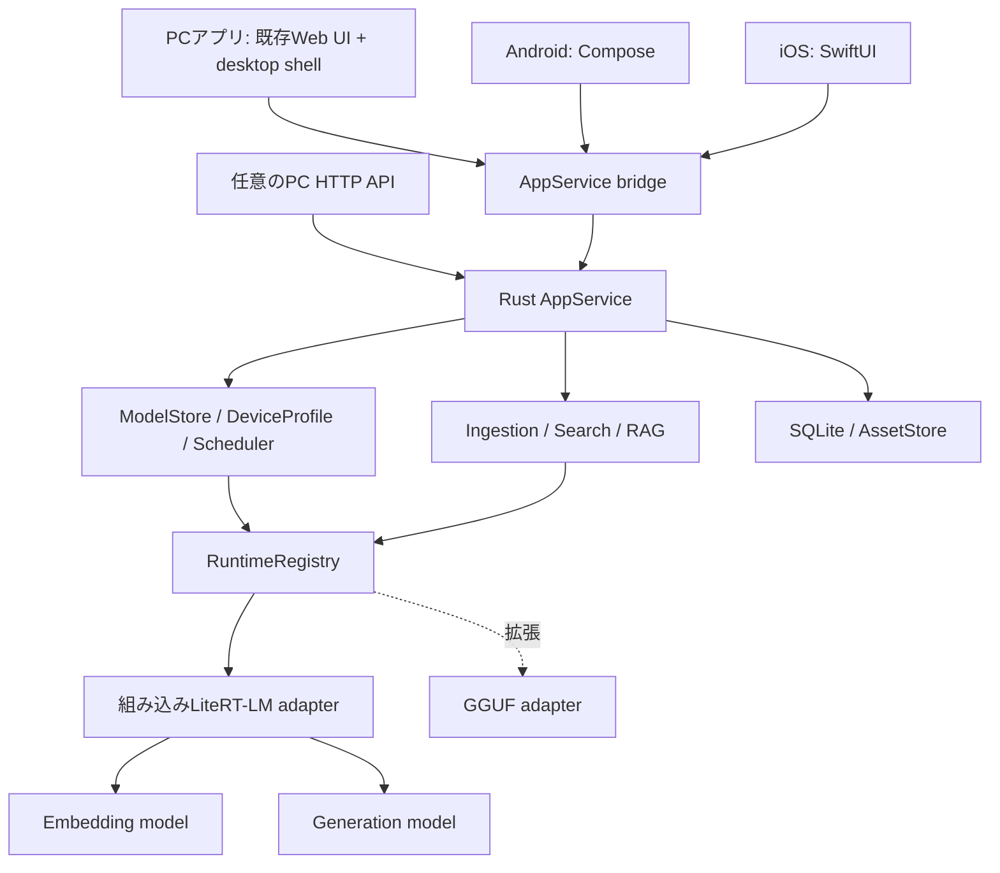

# mj-llm アーキテクチャ設計

[한국어](architecture.md) | [English](architecture.en.md) | [日本語](architecture.ja.md)

> 2026-10-08の原文に対応する文書翻訳です。コマンド・固定ID・実装/検証状態を維持しています。

> 作成：2026-10-08。状態：製品設計とN0 macOS CPU adapter実装・実smoke検証。製品全体は未実装。
> 本文書はmj-llmの設計原本です。旧プロジェクトのパスが出る作業表は[分離境界](project-separation.ja.md)を参照してください。

## 1. 決定・想定・完了範囲

| 区分 | 内容 |
|---|---|
| ユーザー確定要件 | 進行中作業の継承、主要全プラットフォームで独立実行、Ollama不要のマルチモーダル製品 |
| 設計判断 | 共通Rust application core、組み込みLiteRT-LM優先、OS別package、検索・生成モデル分離 |
| 基本想定 | 個人用・ローカル優先、初回は文書・写真検索と根拠付き対話、韓国語品質を優先検証 |
| 拡張 | 音声・動画検索、追加モデル、MCP、Trusted Node、任意のプロジェクト移行 |
| 未確定 | 最低OS・機器、codec、native artifact revision、配布経路、機器間同期要件 |

同じ製品とは同じバイナリや全機器で同じGPU実装を意味しません。domain・保存規則・API意味を共通化し、OS別アプリと加速処理をビルドします。モデルの初回取得後はoffline動作が基本です。初回からネットワークがない場合は検証済みローカルモデルimportまたはダウンロード必要状態を提示します。

初版は自動同期・アカウント・クラウドを要求しません。PCとスマートフォンに独立プロジェクトを作れます。手動project export/importはN4、既存JSON対話の移行はN1必須です。

必須はWindows・macOS・Linux・Android・iOS/iPadOSです。基準architectureと追加候補は[製品企画の表](product-plan.ja.md)に従います。ブラウザー単独実行は将来候補という想定です。N1 PCプレビューとN2全プラットフォーム正式版を区別します。

## 2. 公式対応の根拠と採用条件

2026-10-08確認。下記の公式対応と本プロジェクトの実装・検証完了は別です。

| 根拠 | 確認事項 | 設計上の意味 |
|---|---|---|
| [LiteRT-LM概要](https://developers.google.com/edge/litert-lm/overview) | PC・Android・iOSとEmbeddingGemma 2を案内、SwiftはEarly Preview | 共通エンジン第一候補。OS/SDK/加速器別gateが必要 |
| [Embedding API](https://developers.google.com/edge/litert-lm/embedding_models) | Python・Kotlin・Swift・JS例とマルチモーダルinterface | モバイルPythonサービスなしの組み込みSDKを検証 |
| [C++ API](https://developers.google.com/edge/litert-lm/cpp) | engine・conversation・非同期callback・multimodal content | RustがC++ ABIに直結しないC bridgeが必要 |
| [Swift API](https://developers.google.com/edge/litert-lm/swift) | Apple SDKとMetal経路 | iOS native bridgeの第一候補 |
| [EmbeddingGemma 2カード](https://huggingface.co/google/embeddinggemma-2) | text・image・audio・video embedding、MRL、precision注意 | 検索モデル。回答生成・ASR/OCRと区別 |
| [Text-Vision artifact](https://huggingface.co/litert-community/embeddinggemma-2-text-vision-440m-litert-lm) | text・image配布候補 | N0/N1基本候補。file・revision・hash検証後採用 |
| [全modality artifact](https://huggingface.co/litert-community/embeddinggemma-2-740m-litert-lm) | 全入力向け配布候補 | N3候補。ダウンロード容量から実行RAMを推定しない |
| [llama.cpp対応変更](https://github.com/ggml-org/llama.cpp/pull/30054) | EmbeddingGemma 2対応をmerge | 任意の代替候補。endpoint・modality別実動作は別検証 |

LiteRT embedding案内とHugging Faceカードではtask prefix例が異なります。`latest`文書の文字列を混在させません。N0で固定metadata・SDK前処理・公式テストを比較し、正規形式をgolden fixtureに固定します。検証前にPython text経路のprefixをnativeへそのままコピーしません。

## 3. アプリ・コア・runtimeの責務



- PC shell第一候補は既存HTML/JSを利用できるTauri系です。N0でIPC・ファイル選択・native library package・署名・更新を検証してversionを固定します。既存Web UIをモバイルnative完成とは数えません。
- `AppService`はcommand・進行event・cancelを所有し、HTTP型やUI frameworkを参照しません。モバイルbridgeはUniFFI系と狭いC ABIをN0で比較して固定します。
- PCはC++ SDKの前に独自の狭いC bridgeを置きます。Android/iOSは公式Kotlin/Swift SDKを使うhost adapterを優先検証します。共通Rust要求をnative workerへ渡し、共通eventへ戻します。
- OS hostは写真/文書権限、codec、secure storage、thermal/memory event、lifecycleを担当します。製品方針・job状態・indexの単一所有者はRustです。
- モバイルはアプリ内で実行します。PCでnative crash隔離に別inference workerが必要なら同梱し、別途導入やPATH探索を要求しません。
- backendは実機profileで選択します。CPU基準を先に通し、GPU/NPUは対応構成のみ有効化します。加速失敗時は同一artifactの検証済みCPUを1回試し、モデル変更・外部送信を暗黙には行いません。

## 4. コア契約と安全なFFI

以下は設計上の名前・責務で、現在の公開APIではありません。

| 契約 | 必須動作 |
|---|---|
| `ModelStore` | manifest照会、download/resume、verify/import/delete、導入状態永続化 |
| `RuntimeRegistry` | runtime/artifact/backend組合せ判定、load/unload、resident lease |
| `InferenceRuntime` | describe/embed/generate/cancel/unload、非対応operationの明示拒否 |
| `AppService` | project・asset・job・検索・対話command、event購読 |
| `PlatformHost` | 権限付きfile handle、media decoder、lifecycle・resource pressure通知 |

`RequestContext`は`request_id`・`project_id`・`deadline`・`cancel_token`・`policy_profile`を含みます。embedding要求はtask・space・順序付きcontent、generation要求はrole別content・生成上限を持ちます。eventは`queued`・`loading`・`progress`・`token`・`citation`・`metrics`・`completed`・`cancelled`・`failed`で、terminalは正確に1つです。transport切断とモデル停止を分離し、SDK停止確認までleaseを解放しません。

FFIにはopaque handle・明示長・固定幅整数・status codeを使います。同じ境界のallocator/freeで解放し、C++例外/Rust panicをABI外へ伝播しません。callback payloadは戻る前にcopyし、handle破棄前に実行中callbackを待ちます。指定native workerで直列化し、UI threadやTokio reactorをblockしません。bounded queueでprogressは統合できますがtoken・terminalを黙って捨てません。

## 5. モデルpackage・capability・メモリ

基本論理モデルは`search-text-image`と`chat-small`です。N3で`search-multimodal`を追加します。embeddingとgenerationのIDは交換できません。生成モデルの画像/音声理解はembeddingとは別に判定します。

catalog v2の各artifact：

```text
model_id, task_kind, artifact_id, upstream_revision,
files[{relative_path, bytes, sha256, source_url}], license_ref,
runtime_id, runtime_version_range, format, quantization,
platforms[{os, arch, min_os, sdk_version, accelerator, verification}],
input_modalities, output_modalities, context_limit, dimensions,
preprocess_profile_id, prompt_profile_id, estimated_peak_bytes,
measured_profiles[], lifecycle, manifest_signature
```

`effective_capability = model ∩ artifact ∩ runtime ∩ device ∩ project_policy`です。text/image/audio/videoを単一multimodal booleanにまとめません。非対応は入力前に理由を示し`unsupported_modality`を返します。検索embeddingは音声文字起こし・画像生成・動画生成を含みません。

導入状態は`absent → downloading → verifying → installed`、失敗fileはquarantineします。同じETag/revisionのみ再開し、hash/manifest検証後atomic renameします。推論中削除はlease終了まで保留します。更新は並列配置した新版を検証後pointerを切り替え、直前正常版へrollback可能にします。モバイルで取得するのはモデルdataで、実行codeは署名付きアプリ更新のみです。

メモリ判定は`weights + generation KV + media decode/tensors + runtime overhead + pending reservations + safety reserve`です。download MBとruntime RAMを同一視せず、N0実測前に最低RAMを保証しません。

モバイルの既定同時推論は1件です。対話的要求を索引より優先し、索引はchunk境界で譲ります。RAM不足なら検索後embeddingをunloadしてgeneratorをloadし、最初のtoken遅延を計測表示します。thermal seriousで索引pause、critical/memory pressureで新規jobを止め、安全境界でunloadします。停止不能なnative call中にhandleを強制解放しません。

## 6. メディア入力と前処理

外部要求はpathでなく登録済み`asset_id`を使います。アプリpickerで選びアプリ領域へcopyするのが既定です。原本参照はOSの永続権限がある場合のみ任意で許可します。SDKがpathを要求する場合、adapterが承認assetを内部pathへ解決します。入力URLをSDKに勝手にdownloadさせません。

```json
{
  "project_id": "p1",
  "task": "search_query",
  "embedding_space_id": "space-v1",
  "items": [
    {"id": "q1", "content": [{"type": "text", "text": "자전거가 나온 장면"}]},
    {"id": "clip1", "content": [
      {"type": "video", "asset_id": "a1", "start_ms": 12000, "end_ms": 22000}
    ]}
  ]
}
```

item内のcontent順序を維持し、itemごとに1ベクトルを返します。複数itemは別ベクトルです。placeholder生成・processor順序対応はadapterが担当し、ユーザーに特殊token入力を求めません。上の混合要求は全modality profileのみ許可します。例中の韓国語は固定入力として維持しています。

| 入力 | 処理 | 根拠位置 |
|---|---|---|
| TXT/Markdown/PDF | 実tokenizerでchunk化、見出し・段落維持、PDF page識別 | source revision + page + character range |
| 画像 | MIME・decode確認、EXIF回転、サイズ制限、固定processor、原本上書きなし | asset revision + image/frame ID |
| 音声（N3） | 固定sample-rate/channel、短い重複区間、意味embeddingとASR分離 | 原本start/end ms |
| 動画（N3） | presentation timestampでframe抽出、区間別frame/audio予算、無音許可 | 原本start/end ms + frame timestamps |

初期候補はtext 512 tokens/64 overlap、audio 15秒/2秒overlap、video 10秒区間/1fpsです。実装初期値でありSDK/model保証ではありません。N0/N3品質評価で確定しprofileをversion管理します。音声・動画全体をメモリへ読まず限定区間をdecodeします。合計tokenがartifact contextを超えれば分割または明示エラーです。

初回の暫定入力上限は文書50MiB/500ページ、写真20MiB/40MPです。N3では1GiB/60分を初期上限として検証します。import前に上限・空き容量を確認し、超過fileを黙って切り詰めません。codecはOS decoder別matrixで公開します。OCRなしのscan PDFは画像検索対象で、text検索可能とは表示しません。

## 7. Index・version・検索

SQLiteをmetadata・job状態の原本とします。最初はproject別normalized float32の厳密cosine scanとFTS5を組み合わせ、ANNは測定後に追加します。10,000 × 512次元のraw vectorは約19.5MiBで、metadata・cache・原本容量は別です。10,000 segmentを初期性能基準にし、超過時は警告・分割を提案します。

必須table：

```text
projects(id, policy, created_at)
assets(id, project_id, source_revision, content_hash, mime, storage_ref, state)
segments(id, asset_id, source_revision, locator_json, text_ref, preprocess_id)
embedding_spaces(id, model_revision, artifact_hash, runtime_profile,
                 dimension, normalization, prompt_profile, preprocess_profile)
embeddings(project_id, space_id, segment_id, vector_blob)
index_generations(id, project_id, space_id, state, active)
generation_segments(generation_id, segment_id)
jobs(id, project_id, operation, checkpoint, state, idempotency_key, error_code)
conversations/messages/citations, installed_artifacts
```

primary keyは`(project_id, space_id, segment_id)`です。segmentはsource revision・前処理versionに結び付いた不変recordで、active generation所属だけを検索します。新generation作成中に既存vectorを上書きしません。model・quantization・dimension・前処理・prefix変更は原則新spaceです。同family・同次元だけでPyTorch/LiteRT/GGUFを混ぜません。同等性試験後も再利用には明示migrationが必要です。モデル更新時は新index generationを作り、全検証後transactionでactive pointerを切り替えます。

project・権限・削除を先に制限し、query embedding → 許可modality別semantic top-K → text有りsegmentのFTS → rank fusion → 同source/重複区間除去の順です。cosineとlexical raw scoreを足さずRRF rankを統合します。初期K=40、RAG上限6件を生成contextでさらに制限します。FTS textのない画像・音声もsemanticだけで残します。韓国語FTSの形態素・部分一致は別測定です。

削除は先にtransactionでtombstoneを記録し即時検索除外、その後vector・thumbnail・cacheを整理します。既存引用は削除済み根拠と表示し、物理blockの完全消去は保証しません。

## 8. 根拠付き対話とUX

onboardingは機器診断 → 検索/対話package推薦 → 容量・license確認 → download → sample検索です。モデルなしでもproject・file一覧を開けます。homeは「資料追加」「検索」「質問」が主操作です。完了表示は総数と成功・保留・失敗を分けます。

文書・写真への質問：

1. PDF・写真を追加し、asset別索引状態と取消を表示します。
2. 検索語から結果cardと原本page/写真を先に開きます。
3. 「この資料で回答」またはproject chatで、検索根拠をgeneratorへ渡します。
4. vision対応generatorには実画像asset、text専用には既存OCR/ユーザーcaptionのみを渡します。画像embeddingを説明文にはしません。
5. 検証済みcitation IDを付け、不在IDは根拠エラーにします。根拠不足を明示します。
6. page・写真・N3再生区間へ移動でき、生成を停止できます。

message v2は`content: ContentPart[]`と`status=complete|partial|cancelled|failed`を保存します。旧文字列は単一text partです。資料・OCR・transcriptは非信頼evidence領域に入れ、system指示・権限と分離します。抽出textがなければ架空引用を作りません。embedding障害時のtext lexical-onlyは明示できても、画像・音声検索成功とは表示しません。

## 9. APIとモバイルlifecycle

以下は未実装の提案です。`mj_llm_wapper/contracts/openapi.yaml`は互換性参照で、本リポジトリの公開APIではありません。任意HTTP facadeはN4、N1/N2 UIはAppService直呼びです。facadeでは既存`/v1/embeddings`のtext・既定768次元を互換検証し、内部indexは品質評価を前提に512次元を使います。任意multimodal inputをOpenAI互換とは表示しません。

| Interface | 動作 |
|---|---|
| `GET /api/v2/capabilities` | operation・modality・platform・artifact別の対応/未検証/阻止理由 |
| `POST /api/v2/projects/{id}/assets` | uploadまたはnative import handle登録、asset ID返却 |
| `POST /api/v2/projects/{id}/index-jobs` | 長期索引開始、202 + job ID |
| `GET /api/v2/jobs/{id}` / `POST .../cancel` | 状態・進行・checkpoint・取消 |
| `POST /api/v2/embeddings` | 順序付きContentPart itemのmultimodal vector |
| `POST /api/v2/projects/{id}/search` | source locator・score provenance付き結果 |
| `POST /api/v2/projects/{id}/answers` | 根拠検索後生成、token/citation/terminal event |
| `POST /v1/chat/completions` | 既存text subset維持、新modalityはconformance後公開 |

モバイルはnative bridgeで同commandを呼び、HTTP listenerを既定搭載しません。PC APIも明示有効化するloopback限定です。loopbackでもBearer token認証、CORS既定拒否、要求サイズ・同時数制限を適用します。native UIはpayload project IDだけを信頼せずopen workspace sessionと照合します。

Narmerのstream/non-stream・構造化出力・標準error・実行provenanceはN4検証へ残します。native schema制約とprompt JSONを区別し、検証失敗を成功として返しません。要求model・実artifact/hash/runtime・queue/inference latencyを返し、取得不能token数は推定または未提供と表示します。場所抽出・URL収集など呼出側domain業務をコアへ移しません。

`unsupported_modality`・`artifact_incompatible`・`insufficient_memory`・`permission_revoked`・`asset_unavailable`・`index_rebuild_required`・`thermal_paused`などをoperation別に定義します。v1は可能なら既存stable codeへ変換し、v2は詳細・retryable・復旧操作を提供します。

jobは`queued → preparing → running → completed`、分岐は`paused`・`cancelled`・`failed`です。segment完了transactionごとにcheckpointを保存します。backgroundでforeground作業を安全境界で止め、resumeで完了segmentをskipします。Android/iOS background taskはOS許容時間・資源内のみで、常時実行を保証しません。突然終了した`running`は復旧時`paused`にします。

## 10. 失敗・復旧とデータ境界

| 状況 | 処理・ユーザー操作 |
|---|---|
| download中断・容量不足 | 検証可能partialのみ保持、空き確保後再開 |
| artifact/hash/ABI不一致 | 実行阻止・quarantine・同検証版再導入案内 |
| GPU初期化失敗 | 同artifact検証済みCPUを1回、失敗なら明示終了 |
| メモリ不足・発熱 | background索引pause、lease終了後unload、小型model切替は別確認 |
| 破損file・非対応codec | 該当assetだけ失敗、他を継続し具体的理由表示 |
| 権限取消・原本削除 | unavailable表示、無限retryせず再選択要求 |
| index/profile変更 | 新generation再構築、完了まで旧整合index使用 |
| 生成中終了 | 部分回答保存、自動再生成禁止、ユーザー再試行 |
| 根拠なし・無効citation | citation拒否・根拠不足表示、原本導線維持 |

原本・embedding・質問は既定で外部送信しません。モデルdownload・catalog更新は別network操作でsource textを含みません。開発logはID・code・集計のみで、原文・token・絶対user pathを残しません。keyはOS secure storeに保存します。app sandbox/OS保存保護を使い、DB暗号化はthreat model・配布要件の別gateです。生体識別・顔認識はv1対象外です。

## 11. 検証gateと暫定性能予算

下記は製品目標で、現在の達成値ではありません。N0で機器・OS・runtime・artifact hashを固定して基準機器別予算を決めます。N0 mobileにはAndroidスマートフォン1台・iPhone1台以上の実機証拠が必要で、N2にはAndroidタブレット・iPad各1台のE2Eを追加します。macOS arm64・Windows x64・Linux x64は個別検証です。取得可能でも未検証構成をVerifiedと表示しません。

| Gate | 合格条件 |
|---|---|
| G1 独立導入 | 全OSでOllama/Pythonなし、モデル準備後offline検索・対話 |
| G2 ABI/lifecycle | cancel・unload・並列callback・background/kill/resumeでUAF・terminal重複・checkpoint欠落なし |
| G3 ベクトル品質 | 全対応次元でfinite/unit norm、native/Python順位比較、prefix golden fixture |
| G4 multimodal | 韓国語text→image 100問以上、text→text 100問以上、N3 audio/video各50問以上、positive/negative・根拠なし質問を含む |
| G5 検索品質 | Recall@5目標0.85以上、nativeはreference比3%p超の低下禁止、modality別集計 |
| G6 引用・隔離 | locator有効100%、他project・削除資料露出0件、範囲外asset ID拒否 |
| G7 復旧 | 各索引段階強制終了後の完了segment重複なし、部分失敗で全index破損なし |
| G8 資源 | 各基準mobileで20回連続質問・30分索引中OOM 0件、reservation超過0件 |
| G9 遅延 | warm検索10k segments p95目標PC 1秒・mobile 2秒以内、cold load・索引・生成は別表示 |
| G10 セキュリティ・配布 | offline network観察、sandbox path、権限取消、整合性、署名package・更新rollback |

品質とともにlatency・peak RSS・空きmemory・thermalを記録します。Pythonの1問smokeはG4/G5を代替しません。generator TTFT・context予算・最低OSはN0結果で確定します。全拡張モデルの同時対応は初回gateではありません。

## 12. 現コードからの実装順

| 順序 | file/module | 作業 | 証拠 |
|---|---|---|---|
| T0 | `docs/model-support`予定 | SDK/artifact固定、PC・Android・iOS load/embed PoC、prefix差確認 | G1/G3各platform feasibility |
| T1 | `src/domain.rs` → domain crate | ContentPart・Asset・EmbeddingSpace・Job・message v2、文字列reader維持 | migration fixtures |
| T2 | `src/runtime.rs`・`src/embeddings.rs` → inference-core | 導入/推論分離、Registry・lease/cancel/bounded queue | adapter conformance |
| T3 | `catalog/models.json`・`src/catalog.rs`・`src/cli.rs` | catalog v2、独立download/verify/import、推薦のOllama到達性削除 | clean-install・resume/hash fault |
| T4 | runtime-litert + platform bridges予定 | native embed/generate、artifact別backend、resource admission | 実model・実機G1/G2/G3 |
| T5 | `src/store.rs` → persistence | SQLite・backup・transactional JSON import、asset/index/job保存 | 復旧・rollback fixtures |
| T6 | ingestion/search/rag予定 | 文書・写真 → segment → embedding → hybrid search → citation | G4～G7 |
| T7 | `src/api.rs`・`src/main.rs`・`web/`・apps予定 | AppService分離、PC shell・Compose・SwiftUI、任意HTTP | OS別E2E |
| T8 | release pipeline予定 | sandbox・署名・SBOM・offline導入・更新・実測matrix | G8～G10 |
| T9 | audio/video adapters予定 | 区間decoder・cross-modal検索・再生locator | N3品質・時間整合 |

T0 mobileはT1～T7より先に行い、PC実装後にmobile非対応と判明するリスクを減らします。5プラットフォーム同時完成を主張せず、N1 PC・N2 mobileを別記録にします。

`tools/reference/embedding_server.py`等はnative数値・順位比較用に維持します。既存`OllamaRuntime`は取り込まず、必要な回帰fixtureを非個人データで作成します。Ollama cacheを変換・削除せずnative artifactを別取得します。旧`runtime_model` aliasの対話は元model名を保ち、新model関連付けを明示選択します。

JSON importは選択入力を検証後、別transactionで実行します。原本を変えず、source hashと元conversation IDで重複判定します。role・文字列content・size・timestampを検証し非対応recordを報告、失敗時は今回importだけrollbackします。aliasを導入指示と解釈せず、API key・設定・model cacheは移行対象外です。

推奨workspace追加単位は`app-core`・`inference-core`・`runtime-litert`・`model-store`・`media-core`・`search-core`・`persistence`・`platform-bridge`です。未来の空adapterを先に量産せず、T0～T4に必要な境界から抽出します。

## 13. 未決事項と変更時の影響

- **初回範囲：** 文書・写真が基本。4 modality同時ならN3 decode・品質・codec gateをN2へ統合します。
- **最低機器/OS：** 保有・対象機器とSDK buildで決め、非対応を自動remoteへ切り替えません。
- **UI/bridge：** 既存Web再利用とnative mobileを基本に検証。他UIでもdomain・index・runtime契約を維持します。
- **SDK/prefix：** T0でrelease/commit・artifact・前処理整合性を固定。設計だけでbinary互換を保証しません。
- **配布・暗号化・同期：** app store/直接配布、DB暗号化、機器同期は未定で、自動network機能を追加しません。

## 14. プラットフォームのビルド・配布設計

以下は実装予定のpackage境界であり、確定SDK version・最低OS宣言ではありません。

| Platform | app/bridge | 同梱 | 必須検証 |
|---|---|---|---|
| Windows x64 | desktop shell → Rust → C bridge → LiteRT-LM C++ | core・native library・必要runtime | clean install、非ASCII path、DLL、offline検索/対話 |
| macOS arm64 | desktop shell → Rust → C bridge → LiteRT-LM C++ | core・native library・署名対象全体 | 署名・権限・model path・CPU・検証GPU選択 |
| Linux x64 | desktop shell → Rust → C bridge → LiteRT-LM C++ | 基準distribution ABI用library | glibc/graphics/WebView、X11/Wayland対象明示、offline |
| Android arm64 | Compose → Rust AppService ↔ Kotlin host adapter | Rust native library・組み込みSDK | 文書/写真権限、低memory・発熱・background、phone/tablet |
| iOS/iPadOS arm64 | SwiftUI → Rust AppService ↔ Swift host adapter | Rust library・組み込みSDK | file権限、background/kill、iPhone/iPad、配布build |

SDK/bridgeはN0で固定します。OS path・permission token・secure store handleはPlatformHost所有で、domainへplatform型を露出しません。coreはsystem shellでengineを探し導入しません。model重みは別data、native libraryはapp packageです。

最初のN0は公式v0.18.0 macOS C API配布を使います。C++ SDK型を直接bindせず、例外を封じる独自C bridgeとsafe Rust wrapperを接続します。`catalog/n0.lock.json`にSDK commit・library/header hash・model revision/hashを固定しました。CPU同期呼び出しのみで、製品worker・cancel・streamingは未実装です。[N0記録](n0-feasibility.ja.md)に範囲・再現手順があります。

CIは共通Rust → target cross-build/link → native adapter契約 → package導入に分けます。cross-build・simulatorは実機推論の証拠になりません。release候補ごとにapp commit、compiler/SDK/bridge lock、artifact hash、OS/CPU/機器、backend、fixture revision、品質/遅延/peak memory、package hash、失敗log位置を1記録で関連付けます。原本ユーザー資料・秘密は含めません。

対象別署名・整合性・旧版からの更新を検証します。DB migration前にbackupし、新schemaを旧appで開かせません。app/data rollbackを対で確認し、model rollbackは既存embedding-spaceと関連付けます。Linux対応は検証したdistribution/version範囲で明示します。

## 15. N0判断とプラットフォーム阻害への対応

最初は固定SDK/artifactのload → text/image embed → finite/次元確認 → unloadです。同環境で小型generatorの最初のtoken・完了・cancelも試し、検索のみ成功を製品実現可能と判定しません。その後2モデル順次切り替え、memory・権限・package・golden retrievalを確認します。

各構成を`unverified → building → device-tested → accepted`または`blocked`で記録します。`accepted`はN0 feasibility、製品`Verified`にはN1/N2 G1～G10証拠が必要です。API symbol欠落・preview不具合・非対応artifact・OOMを再現条件とともに残します。

必須OSのLiteRT-LMが止まった場合、N0 gateを未完了のまま保ち、別固定SDKまたは組み込みadapterを小さなPoCで評価します。別artifactには新embedding-space・品質評価が必要です。Pythonサービス・Ollama・remote PCを独立実行成功とは数えません。代替も失敗なら必須platformを維持し、releaseを延期して阻害内容を記録します。
