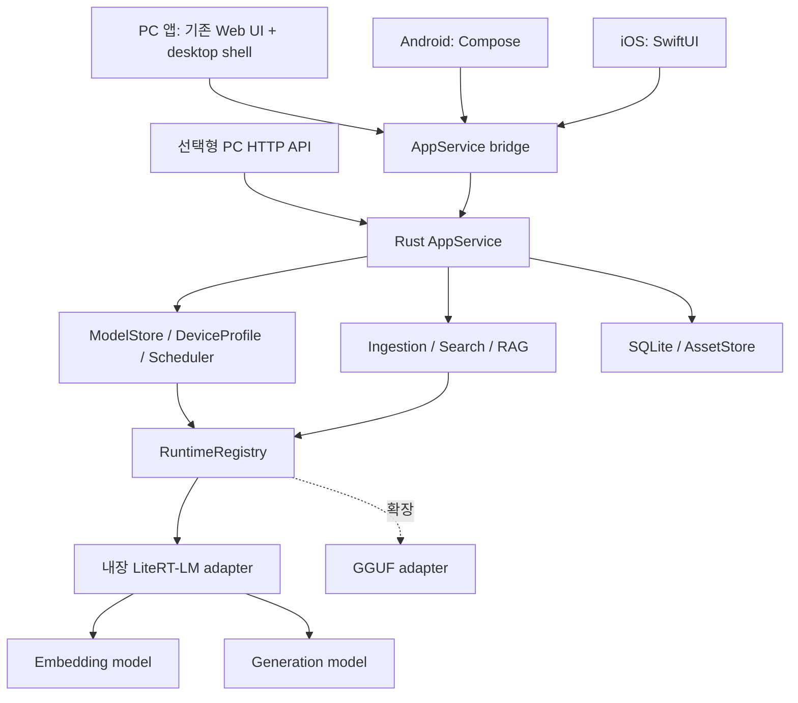

# mj-llm 아키텍처 설계

[한국어](architecture.md) | [English](architecture.en.md) | [日本語](architecture.ja.md)

> 작성: 2026-10-08 · 상태: 제품 설계 + N0 macOS CPU adapter 구현·실제 smoke 검증. 전체 제품은 미구현.
> 이 문서는 mj-llm의 설계 원본이다. 기존 프로젝트 경로가 등장하는 이전 작업 표는 [분리 경계](project-separation.md)를 참고한다.


## 1. 결정·가정·완료 범위

| 구분 | 내용 |
|---|---|
| 사용자 확정 요구 | 기존 진행 작업 계승; 모든 주요 플랫폼에서 독립 실행; Ollama 없는 멀티모달 제품 |
| 설계 결정 | 공통 Rust application core, 내장 LiteRT-LM 우선, 플랫폼별 패키지, 검색 모델과 생성 모델 분리 |
| 기본 가정 | 개인용·로컬 우선; 1차 출시 문서·사진 검색 + 근거 대화; 한국어 우선 품질 검증 |
| 확장 범위 | 음성·영상 검색, 추가 모델, MCP, Trusted Node, 선택형 프로젝트 이동 |
| 미확정 | 최소 OS/장치, 지원 코덱, native artifact revision, 배포 채널, 장치 간 동기화 요구 |

같은 제품은 같은 바이너리 또는 모든 기기의 동일 GPU 구현을 뜻하지 않는다. 도메인·저장 규칙·API 의미를 공유하고 OS별 앱과 가속 구현을 빌드한다. 최초 모델 다운로드 이후 핵심 기능은 인터넷 없이 동작한다. 네트워크가 차단된 초기 설치에서는 검증된 로컬 모델 파일 가져오기 또는 다운로드 필요 상태를 제공한다.

첫 버전은 자동 기기 간 동기화·계정·클라우드를 요구하지 않는다. PC와 휴대폰에 독립 프로젝트를 만들 수 있다. 수동 프로젝트 내보내기/가져오기는 N4에서 제공하며, 기존 JSON 대화 이전은 N1의 필수 마이그레이션이다.

필수 플랫폼은 Windows·macOS·Linux·Android·iOS/iPadOS다. 지원 아키텍처의 기준과 추가 후보는 [제품 기획서](product-plan.md)의 플랫폼 표를 따른다. 브라우저 단독 실행은 후속 후보라는 기본 가정이다. N1 PC 미리보기와 N2 전체 플랫폼 정식 출시를 구분한다.

## 2. 공식 지원 근거와 채택 조건

2026-10-08 확인. 아래 공식 지원은 이 프로젝트에서의 구현·검증 완료와 구분한다.

| 근거 | 확인한 사실 | 설계상 의미 |
|---|---|---|
| [LiteRT-LM 개요](https://developers.google.com/edge/litert-lm/overview) | PC·Android·iOS와 EmbeddingGemma 2 지원을 안내; Swift는 Early Preview | 공통 엔진 우선 후보. OS/SDK/가속기별 gate 필요 |
| [Embedding API 안내](https://developers.google.com/edge/litert-lm/embedding_models) | Python·Kotlin·Swift·JS 예제와 멀티모달 임베딩 인터페이스 | 모바일 Python 서비스 없이 내장 SDK 사용 가능성을 검증 |
| [C++ API](https://developers.google.com/edge/litert-lm/cpp) | 엔진·대화·비동기 callback과 멀티모달 content 제공 | Rust가 직접 C++ ABI에 의존하지 않도록 C bridge 필요 |
| [Swift API](https://developers.google.com/edge/litert-lm/swift) | Apple 앱용 SDK와 Metal 경로 | iOS native bridge의 우선 구현 경로 |
| [EmbeddingGemma 2 카드](https://huggingface.co/google/embeddinggemma-2) | 텍스트·이미지·오디오·비디오 임베딩, MRL, precision 주의사항 | 검색용 모델. 답변 생성 및 ASR/OCR 능력과 구분 |
| [Text-Vision artifact](https://huggingface.co/litert-community/embeddinggemma-2-text-vision-440m-litert-lm) | 텍스트·이미지 배포 후보 | N0/N1 기본 후보; 파일·revision·hash 검증 후 채택 |
| [전체 modality artifact](https://huggingface.co/litert-community/embeddinggemma-2-740m-litert-lm) | 전체 입력용 배포 후보 | N3 후보; 다운로드 크기로 실행 RAM을 추정하지 않음 |
| [llama.cpp 지원 변경](https://github.com/ggml-org/llama.cpp/pull/30054) | EmbeddingGemma 2 지원 코드 병합 | 선택형 대안 후보. 서버 endpoint와 modality별 실동작은 별도 검증 |

주의: LiteRT embedding 안내의 task prefix 예시와 Hugging Face 모델 카드 예시가 서로 다르다. `latest` 문서의 문자열을 혼합하지 않는다. N0에서 고정 artifact metadata·SDK preprocessing·공식 테스트를 대조해 정규 형식을 정하고 golden fixture로 고정한다. 현재 Python text 경로의 prefix를 native 경로에 그대로 복사하는 것은 검증 전 금지한다.

## 3. 앱·코어·런타임 책임



- PC 셸의 1차 후보는 기존 HTML/JS를 수용하는 Tauri 계열이다. N0에서 IPC, 파일 선택, native library 패키징, 서명·업데이트 경로를 검증한 뒤 버전을 고정한다. 현재 웹 UI를 모바일 네이티브 완료로 계산하지 않는다.
- `AppService`는 명령·진행 이벤트·취소를 소유하고 HTTP 타입이나 UI 프레임워크를 참조하지 않는다. 모바일 bridge는 UniFFI 계열 또는 좁은 C ABI를 N0에서 비교하고 하나를 고정한다.
- PC adapter는 C++ SDK 앞에 직접 작성한 좁은 C bridge를 둔다. Android/iOS는 공식 Kotlin/Swift SDK를 호출하는 host adapter를 먼저 검증한다. Rust의 동일 요청을 native worker에 전달하고 결과를 공통 이벤트로 돌려준다.
- OS host는 사진/문서 선택 권한, 코덱 디코딩, secure storage, thermal/memory event, 앱 lifecycle을 담당한다. 제품 정책·작업 상태·인덱스의 단일 소유자는 Rust 코어다.
- 모바일은 앱 프로세스 안에서 실행한다. PC의 별도 inference worker는 native crash 격리가 필요할 때 앱에 함께 패키징하며 사용자 별도 설치나 PATH 검색을 요구하지 않는다.
- backend 선택은 실기기 profile로 결정한다. CPU 기준 경로를 먼저 통과시키고 GPU/NPU는 지원 조합에서만 활성화한다. 가속 실패 시 같은 artifact의 검증된 CPU 경로를 한 번 시도하며 모델 변경·원격 전송은 묵시적으로 수행하지 않는다.

## 4. 코어 계약과 안전한 FFI

목표 계약은 다음 책임으로 나눈다. 아래 이름은 신규 설계이며 현재 공개 API가 아니다.

| 계약 | 필수 동작 |
|---|---|
| `ModelStore` | manifest 조회, download/resume, verify, import, delete; 설치 상태 영속화 |
| `RuntimeRegistry` | runtime/artifact/backend 조합 판정, load/unload, resident lease |
| `InferenceRuntime` | describe, embed, generate, cancel, unload; 미지원 operation 명시 거부 |
| `AppService` | 프로젝트·asset·job·검색·대화 command, event subscription |
| `PlatformHost` | 권한 있는 파일 핸들, 미디어 decoder, lifecycle 및 resource pressure 전달 |

`RequestContext`는 `request_id`, `project_id`, `deadline`, `cancel_token`, `policy_profile`을 포함한다. 임베딩 요청은 task·embedding-space·순서 있는 content를, 생성 요청은 role별 content와 generation limit를 가진다. 응답 event는 `queued`, `loading`, `progress`, `token`, `citation`, `metrics`, `completed`, `cancelled`, `failed`이며 terminal event는 정확히 하나다. transport 끊김과 모델 중지는 분리하고 SDK 중지가 확인될 때까지 lease를 해제하지 않는다.

FFI는 opaque handle·명시적 길이·고정 폭 정수·상태 코드를 사용한다. allocator가 생성한 메모리는 같은 경계의 free 함수가 해제한다. C++ exception/Rust panic을 ABI 밖으로 전파하지 않는다. callback payload는 반환 전 복사하고 handle 해제 전에 in-flight callback 종료를 기다린다. 엔진 호출은 지정 native worker에서 직렬화하며 UI thread와 Tokio reactor를 블록하지 않는다. bounded queue에서 진행률은 병합할 수 있지만 token·terminal event를 조용히 버리지 않는다.

## 5. 모델 패키지·capability·메모리

기본 패키지는 `search-text-image`와 `chat-small` 두 논리 모델이다. N3에서 `search-multimodal`을 추가한다. embedding과 generation의 모델 ID를 교환해 사용할 수 없다. 생성 모델의 이미지/음성 이해 여부도 embedding 모델과 별도로 판정한다.

카탈로그 v2의 각 artifact는 다음을 가진다.

```text
model_id, task_kind, artifact_id, upstream_revision,
files[{relative_path, bytes, sha256, source_url}], license_ref,
runtime_id, runtime_version_range, format, quantization,
platforms[{os, arch, min_os, sdk_version, accelerator, verification}],
input_modalities, output_modalities, context_limit, dimensions,
preprocess_profile_id, prompt_profile_id, estimated_peak_bytes,
measured_profiles[], lifecycle, manifest_signature
```

`effective_capability = model ∩ artifact ∩ runtime ∩ device ∩ project_policy`다. `text/image/audio/video`를 단일 multimodal boolean으로 축약하지 않는다. modality가 없으면 입력 전에 이유를 표시하고 `unsupported_modality`를 반환한다. 음성 전사·이미지 생성·동영상 생성은 검색용 embedding capability에 포함하지 않는다.

모델 설치 상태는 `absent → downloading → verifying → installed`이며 실패 파일은 quarantine한다. 다운로드는 ETag/revision이 같은 파일만 이어받고 해시·manifest 검증 후 atomic rename한다. 추론 중 artifact 삭제는 lease 종료까지 보류한다. 업데이트는 새 버전을 나란히 검증한 후 포인터를 전환하며 직전 정상 버전으로 복구할 수 있다. 모바일에서 받는 것은 데이터 모델 파일이며 실행 코드는 서명된 앱 업데이트로만 배포한다.

메모리 허가는 `weights + generation KV + media decode/tensors + runtime overhead + pending reservations + safety reserve`를 사용한다. 다운로드 MB와 runtime RAM을 동일시하지 않는다. N0 실측 전 고정 최소 RAM 보장은 하지 않는다.

모바일 기본 동시 추론은 1개다. 인터랙티브 질의가 색인보다 우선이고 색인은 청크 경계에서 양보한다. RAM이 부족하면 검색 후 embedding을 unload하고 generator를 load해 순차 실행한다. 이 경우 첫 토큰 지연을 측정해 UI에 표시한다. thermal serious에서는 색인을 pause하고 critical/memory-pressure에서는 새 작업을 차단한 뒤 안전 경계에서 unload한다. 중지 불가능한 native call에 대한 강제 handle 해제는 금지한다.

## 6. 미디어 입력과 전처리

외부 요청은 파일 경로 대신 프로젝트에 등록한 `asset_id`를 사용한다. 앱 파일 선택기로 원본을 선택하고 앱 저장공간에 복사하는 것이 기본이다. 원본 참조 모드는 OS의 지속 권한이 있는 경우에만 선택적으로 허용한다. SDK가 경로를 요구하면 adapter가 승인된 asset을 내부 경로로 해석한다. 모델에 전달한 URL을 SDK가 임의 다운로드하게 두지 않는다.

```json
{
  "project_id": "p1",
  "task": "search_query",
  "embedding_space_id": "space-v1",
  "items": [
    {"id": "q1", "content": [{"type": "text", "text": "자전거가 나온 장면"}]},
    {"id": "clip1", "content": [
      {"type": "video", "asset_id": "a1", "start_ms": 12000, "end_ms": 22000}
    ]}
  ]
}
```

하나의 item 안의 content 순서는 보존하고 한 item당 한 벡터를 반환한다. 여러 item은 서로 다른 벡터다. placeholder 생성과 processor의 순서 매핑은 adapter가 책임지며 사용자가 모델별 특수 토큰을 넣을 필요가 없다. 위 혼합 요청은 전체 modality profile에서만 허용된다.

| 입력 | 처리 규칙 | 근거 위치 |
|---|---|---|
| TXT/Markdown/PDF | 실제 tokenizer 기반 청크, 제목·문단 경계 유지; PDF는 페이지 단위 식별 | source revision + page + character range |
| 이미지 | MIME·디코드 확인, EXIF 회전 적용, 크기 제한 후 고정 processor; 원본에 덮어쓰지 않음 | asset revision + image/frame ID |
| 오디오 (N3) | 고정 sample-rate/channel profile, 짧은 겹침 구간으로 분할; 의미 embedding과 ASR 별도 | 원본 기준 start/end ms |
| 영상 (N3) | presentation timestamp로 frame 추출, 구간별 frame/audio 예산; 무음 영상 허용 | 원본 기준 start/end ms + sampled frame timestamps |

초기 청크 후보는 텍스트 512 tokens/64 overlap, 오디오 15초/2초 overlap, 영상 10초 구간/1fps다. 이는 구현 초기값이며 모델·SDK가 보장하는 수치가 아니다. N0/N3 품질 평가로 확정해 profile에 버전 기록한다. 오디오·영상은 파일 전체를 메모리에 읽지 않고 제한된 구간만 decode한다. 이미지·음성·영상의 합산 토큰 예산이 실제 artifact context를 넘으면 분할하거나 명시 오류를 반환한다.

첫 출시의 잠정 앱 입력 상한은 문서 50MiB/500페이지, 사진 20MiB/40MP다. N3는 파일 1GiB/60분을 초기 상한으로 검증한다. 상한과 남은 공간을 import 전에 확인하며 초과 파일을 조용히 잘라 처리하지 않는다. 지원 codec은 OS decoder별 matrix로 공개한다. 스캔 PDF에 OCR이 없으면 해당 페이지를 이미지 검색 대상으로 표시하고 텍스트 검색 가능으로 표시하지 않는다.

## 7. 인덱스·버전·검색

SQLite를 metadata와 job 상태의 원본으로 사용한다. 첫 검색 구현은 프로젝트별 normalized float32 벡터의 정확한 cosine scan과 FTS5 lexical search를 결합한다. ANN은 측정 후 추가한다. 10,000 × 512차원 벡터 원시 데이터는 약 19.5MiB이며 metadata·캐시·원본 공간은 별도다. 10,000 segment를 첫 성능 검증 기준으로 사용하며 초과 시 경고·분할 제안을 제공한다.

필수 테이블:

```text
projects(id, policy, created_at)
assets(id, project_id, source_revision, content_hash, mime, storage_ref, state)
segments(id, asset_id, source_revision, locator_json, text_ref, preprocess_id)
embedding_spaces(id, model_revision, artifact_hash, runtime_profile,
                 dimension, normalization, prompt_profile, preprocess_profile)
embeddings(project_id, space_id, segment_id, vector_blob)
index_generations(id, project_id, space_id, state, active)
generation_segments(generation_id, segment_id)
jobs(id, project_id, operation, checkpoint, state, idempotency_key, error_code)
conversations/messages/citations, installed_artifacts
```

벡터 primary key는 `(project_id, space_id, segment_id)`다. segment는 source revision과 전처리 버전에 묶인 불변 레코드이며 active generation의 membership에 속한 segment만 검색한다. 새 generation을 만드는 동안 기존 벡터를 덮어쓰지 않는다. 모델·양자화·차원·전처리·prefix가 달라지면 기본적으로 새 space를 만든다. 같은 family 또는 같은 차원이라는 이유로 PyTorch, LiteRT, GGUF 벡터를 섞지 않는다. 동등성 시험을 통과해도 재사용은 명시 migration으로만 허용한다. 모델 업데이트 시 새 index generation을 만들고 전체 검증 후 active pointer를 transaction으로 전환한다.

검색은 project/권한/삭제 여부를 먼저 제한하고 query embedding → 각 허용 modality의 semantic top-K → 텍스트가 있는 segment의 FTS → rank fusion → 동일 source/겹친 구간 dedup 순으로 수행한다. cosine과 lexical 원점수를 직접 더하지 않고 RRF의 rank를 합친다. 초기 후보 K=40, RAG 전달 상한 6개를 사용하되 생성 context 예산으로 다시 제한한다. 이미지/오디오처럼 FTS 텍스트가 없는 자료는 semantic 결과만으로도 남는다. 한국어 FTS의 형태소·부분 일치 품질은 별도 측정한다.

삭제는 먼저 tombstone을 transaction으로 기록해 검색에서 즉시 제외하고, 파생 벡터·thumbnail·캐시를 정리한다. 기존 인용은 삭제된 근거로 표시한다. 파일시스템 물리 블록의 완전 소거는 보장하지 않는다.

## 8. 근거 기반 대화와 UX

온보딩은 기기 진단 → 가능한 검색/대화 패키지 추천 → 용량·라이선스 확인 → 다운로드 → 샘플 검색 순서다. 모델이 없어도 프로젝트와 파일 목록은 열 수 있다. 홈의 주 동작은 `자료 추가`, `검색`, `질문하기`다. 완료 문구는 전체 자료 수와 처리 성공/보류/실패 수를 구분한다.

문서·사진 질문의 기본 흐름:

1. 사용자가 프로젝트에 PDF·사진을 추가한다. 자료별 색인 상태와 취소 버튼을 표시한다.
2. 검색어를 입력하면 검색 결과 카드와 원본 페이지/사진을 먼저 연다.
3. `이 자료로 답변`을 선택하거나 프로젝트 채팅에서 질문하면 검색 근거를 생성 모델에 제공한다.
4. 이미지 이해가 가능한 생성 모델에는 실제 이미지 asset을 전달한다. 텍스트 전용 모델에는 존재하는 OCR/사용자 캡션만 전달하며 이미지 embedding을 설명문처럼 사용하지 않는다.
5. 답변에는 검증된 citation ID를 붙인다. 없는 ID는 표시하지 않고 근거 오류 상태로 처리한다. 근거 부족은 답변에 명시한다.
6. 사용자는 페이지·사진·N3의 재생 구간으로 이동하거나 생성을 중지할 수 있다.

대화 메시지 v2는 `content: ContentPart[]`와 `status=complete|partial|cancelled|failed`를 저장한다. 기존 문자열은 단일 text part로 읽는다. 자료 내용·OCR·전사는 비신뢰 evidence 영역에 넣고 system 지시·권한과 분리한다. 추출 텍스트가 없으면 원문에 없는 인용문을 만들지 않는다. 임베딩 서비스 장애 시 텍스트 lexical-only 모드임을 표시할 수 있지만 이미지·음성 검색 성공으로 표시하지 않는다.

## 9. API와 모바일 lifecycle

아래는 제안 계약이며 구현 전이다. 기존 `mj_llm_wapper/contracts/openapi.yaml`은 호환성 참고 원본이고 이 저장소의 현재 공개 API가 아니다. 선택형 HTTP facade는 N4에서 제공하며 N1/N2 UI는 AppService를 직접 호출한다. facade 제공 시 `/v1/embeddings`의 기존 text input과 기본 768차원은 호환 대상으로 검증하고 프로젝트 내부 기본 인덱스는 품질 평가를 전제로 512차원을 사용한다. 임의 멀티모달 input을 OpenAI 호환이라고 표시하지 않는다.

| 인터페이스 | 동작 |
|---|---|
| `GET /api/v2/capabilities` | operation·modality·platform·artifact별 지원/미검증/차단 사유 |
| `POST /api/v2/projects/{id}/assets` | 업로드 또는 native import handle 등록; asset ID 반환 |
| `POST /api/v2/projects/{id}/index-jobs` | 장기 색인 작업 시작; 202 + job ID |
| `GET /api/v2/jobs/{id}` / `POST .../cancel` | 상태·진행률·checkpoint 및 취소 |
| `POST /api/v2/embeddings` | 순서 있는 ContentPart item들의 멀티모달 벡터 생성 |
| `POST /api/v2/projects/{id}/search` | source locator와 score provenance가 있는 검색 결과 |
| `POST /api/v2/projects/{id}/answers` | 근거 검색 후 생성; token/citation/terminal event |
| `POST /v1/chat/completions` | 기존 텍스트 subset 유지; 새 modality는 conformance 완료 후 공개 |

모바일은 같은 명령을 native bridge로 호출하며 HTTP listener를 기본 포함하지 않는다. PC API도 명시적으로 활성화한 loopback 전용 인터페이스다. loopback이어도 인증을 생략하지 않고 Bearer token을 검증하며, CORS 기본 차단·요청 크기/동시성 제한을 둔다. native UI는 payload 안의 project ID만 신뢰하지 않고 현재 열려 있는 workspace session에 맞춰 검증한다.

기존 Narmer 연동에서 요구한 stream/non-stream, 구조화 출력, 표준 오류와 실행 provenance는 N4 conformance 대상으로 보존한다. native schema 제약과 prompt 기반 JSON 생성을 구분하고 검증 실패는 성공으로 반환하지 않는다. 요청 모델·실행 artifact/hash·runtime·queue/inference latency를 반환하며 획득 불가능한 token 수는 추정치 또는 미제공으로 표시한다. 장소 추출·URL 수집 등 호출자 도메인 업무를 코어에 옮기지 않는다.

새 오류는 `unsupported_modality`, `artifact_incompatible`, `insufficient_memory`, `permission_revoked`, `asset_unavailable`, `index_rebuild_required`, `thermal_paused` 등을 operation별로 정의한다. v1에서는 가능한 기존 stable code로 변환하고 v2에서는 상세 사유·retryable·복구 행동을 제공한다.

색인 job 상태는 `queued → preparing → running → completed`이며 `paused`, `cancelled`, `failed`로 분기한다. checkpoint는 segment 완료 transaction마다 저장한다. 앱 background 진입 시 foreground 작업은 안전 경계에서 멈추고 resume 시 완료 segment를 건너뛴다. Android background work와 iOS background task는 허용된 시간·자원 안에서만 사용하며 지속 실행을 보장하지 않는다. 갑작스러운 OS 종료 후 `running` job은 복구 시 `paused`로 판정한다.

## 10. 실패·복구 및 데이터 경계

| 상황 | 처리와 사용자 행동 |
|---|---|
| 다운로드 중단/공간 부족 | 검증 가능한 partial 파일만 유지; 여유 공간 확보 후 재개 |
| artifact/hash/ABI 불일치 | 실행 차단, quarantine, 동일 검증 버전 재설치 안내 |
| GPU 초기화 실패 | 검증된 동일 artifact CPU 경로 1회 시도; 실패 시 명시 종료 |
| 메모리 부족/발열 | background 색인 pause, lease 종료 후 unload; 작은 모델 전환은 별도 확인 |
| 손상 파일/지원 안 되는 codec | 해당 asset만 실패 처리; 나머지 작업 계속, 구체적 원인 표시 |
| 파일 권한 취소/원본 삭제 | asset unavailable 표시; 무한 retry하지 않고 다시 선택 요청 |
| index/profile 변경 | 신규 generation rebuild; 완료 전 기존 일관된 index 사용 |
| 생성 중 앱 종료 | partial 응답 보존, 자동 답변 재생성 금지; 사용자 재시도 |
| 근거 없는 답변/유효하지 않은 citation | citation 거부 및 근거 부족 표시; 원문 이동 경로 유지 |

프로젝트 원본·embedding·질문은 기본 외부 전송하지 않는다. 모델 다운로드와 catalog 갱신은 별도 네트워크 동작이며 source text를 포함하지 않는다. 개발 로그에는 원문·토큰·절대 사용자 경로를 남기지 않고 id·코드·집계 지표만 남긴다. 키는 OS secure store에 저장한다. 앱 sandbox/OS 저장 보호를 사용하며 app-level DB 암호화는 threat model·배포 요구에 따라 별도 gate로 결정한다. 생체정보 식별·얼굴 인식은 v1 기능에 포함하지 않는다.

## 11. 검증 gate와 잠정 성능 예산

아래 수치는 제품 목표이며 현재 달성한 성능 주장이 아니다. N0에서 기기 모델·OS·runtime·artifact hash를 고정하고 기준 기기별 예산을 확정한다. N0 모바일 추론 feasibility에는 최소 Android 휴대폰 1대·iPhone 1대의 실기기 증거가 필요하고, N2 출시에는 Android 태블릿·iPad 각 1대의 E2E 증거를 추가한다. PC는 macOS arm64, Windows x64, Linux x64를 독립 검증한다. 미검증 조합은 다운로드 가능하더라도 Verified로 표시하지 않는다.

| Gate | 합격 조건 |
|---|---|
| G1 독립 설치 | Ollama/Python 없는 각 OS에서 모델 준비 후 offline 검색·대화 성공 |
| G2 ABI/lifecycle | 취소·unload·동시 callback·앱 background/kill/resume 시험에서 UAF, 중복 terminal, 누락 checkpoint 없음 |
| G3 벡터 품질 | 각 지원 차원의 finite/unit-norm 검증; native/Python retrieval 순위 차이 평가; SDK prefix golden fixture 통과 |
| G4 멀티모달 | 한국어 text→image 100질의 이상, text→text 100질의 이상, N3 audio/video 각 50질의 이상; positive/negative·근거 없는 질문 포함 |
| G5 검색 품질 | 고정 fixture의 Recall@5 목표 0.85 이상, native 경로는 해당 reference 대비 3%p 초과 하락 금지; modality별 별도 집계 |
| G6 인용/격리 | citation locator 유효성 100%; 다른 프로젝트·삭제 자료 노출 0건; 범위를 벗어난 asset ID 거부 |
| G7 복구 | 색인 각 단계 강제 종료 후 완료 segment 중복 없음, 일부 실패가 전체 index를 손상하지 않음 |
| G8 자원 | 각 기준 모바일에서 20회 연속 질의·30분 색인 시험 중 OOM 0건; memory reservation 초과 허용 0건 |
| G9 지연 | warm 검색 10k segments p95 목표 PC 1초/모바일 2초 이내; cold-load·색인·생성 지연 별도 표시 |
| G10 보안·배포 | offline 네트워크 관찰, sandbox path, 권한 취소, 모델 무결성, 서명 package·업데이트 rollback 검증 |

품질 평가에는 latency·peak RSS·가용 메모리·thermal state를 함께 기록한다. 로컬 Python의 한 질문 smoke test는 G4/G5를 대체하지 않는다. 생성 모델의 정확한 TTFT·context 예산과 최소 OS는 N0 결과로 확정한다. 1차 출시에서 모든 확장 모델의 동시 지원은 gate가 아니다.

## 12. 현재 코드에서의 구현 작업 순서

| 순서 | 파일·모듈 | 작업 | 완료 증거 |
|---|---|---|---|
| T0 | `docs/model-support` 예정 | LiteRT SDK/artifact 고정, PC·Android·iOS load/embed PoC; prefix 충돌 확인 | G1/G3의 플랫폼별 feasibility 기록 |
| T1 | `src/domain.rs` → domain crate | ContentPart, Asset, EmbeddingSpace, Job, message v2; 문자열 reader 유지 | migration fixtures |
| T2 | `src/runtime.rs`, `src/embeddings.rs` → inference-core | 설치/추론 분리, RuntimeRegistry, lease·cancel·bounded queue | adapter conformance tests |
| T3 | `catalog/models.json`, `src/catalog.rs`, `src/cli.rs` | catalog v2, 독립 다운로드·검증·import; 추천에서 Ollama reachability 제거 | clean-install와 resume/hash fault tests |
| T4 | `runtime-litert` + platform bridges 예정 | native embed/generate, artifact별 backend 선택, resource admission | 실제 모델·실기기 G1/G2/G3 |
| T5 | `src/store.rs` → persistence | SQLite schema·backup·transactional JSON import; asset/index/job 저장 | 중단 후 복구, rollback fixtures |
| T6 | ingestion/search/rag 예정 | 문서·사진 → segment → embedding → hybrid search → citation | G4~G7 |
| T7 | `src/api.rs`, `src/main.rs`, `web/`, apps 예정 | AppService로 분리; PC 셸·Compose·SwiftUI; 선택형 HTTP facade | OS별 사용자 흐름 E2E |
| T8 | release pipeline 예정 | sandbox·서명·SBOM·offline install·업데이트·실측 matrix | G8~G10 |
| T9 | audio/video adapters 예정 | 구간 decoder·cross-modal retrieval·재생 locator | N3 품질·시간 정합성 gate |

T0의 모바일 feasibility는 T1~T7보다 먼저 실시해 PC 구현 후에 모바일 미지원 사실이 드러나는 위험을 줄인다. 다섯 플랫폼을 동시에 완료했다고 주장하지 않고 N1 PC 결과와 N2 모바일 결과를 각각 기록한다.

`tools/reference/embedding_server.py`와 비교 도구는 native 수치·순위 검증용으로 유지한다. 기존 `OllamaRuntime` 구현은 가져오지 않고 필요한 회귀 fixture만 비공개 데이터 없이 새로 작성한다. 기존 Ollama cache는 변환·삭제하지 않는다. native artifact가 필요하면 별도 다운로드한다. 기존 `runtime_model` alias로 저장된 대화는 원래 모델 이름을 보존하고 새 모델 연결을 명시적으로 선택한다.

JSON 대화 import는 사용자가 선택한 입력을 검증한 뒤 별도 transaction에서 실행한다. 원본 파일을 변경하지 않고, source hash와 원본 conversation ID로 중복 import를 판정한다. role·문자열 content·크기·timestamp를 검증하고 미지원 record는 보고한다. 실패 시 이번 import만 rollback한다. 모델 alias는 설치 지시로 해석하지 않으며 API key·설정·모델 cache는 이전 대상이 아니다.

추천 workspace 추가 단위는 `app-core`, `inference-core`, `runtime-litert`, `model-store`, `media-core`, `search-core`, `persistence`, `platform-bridge`다. 처음부터 미래 모든 adapter crate를 빈 구현으로 생성하지 않고 T0~T4에 필요한 경계부터 추출한다.

## 13. 남은 결정과 변경 시 영향

- **첫 출시 범위:** 문서·사진 중심은 기본 가정이다. 네 modality 동시 출시를 선택하면 N3 decode·품질·코덱 gate가 N2 release에 합쳐진다.
- **최소 장치/OS:** 실제 보유·목표 장치와 SDK build 결과로 확정한다. 지원되지 않는 기기를 원격 모드로 자동 전환하지 않는다.
- **UI 프레임워크/bridge:** 기존 웹 재사용과 native mobile을 기본으로 검증한다. 다른 UI를 선택해도 domain·index·runtime 계약은 유지한다.
- **native SDK와 embedding prefix:** 정확한 release/commit, 아티팩트와 전처리 정합성을 T0에서 확정한다. 현재 설계만으로 binary compatibility를 보장하지 않는다.
- **배포·암호화·동기화:** 앱스토어/직접 배포, 별도 DB 암호화, 기기 간 동기화는 미확정이며 자동 네트워크 기능을 추가하지 않는다.

## 14. 플랫폼 빌드·배포 설계

다음은 구현할 패키징 경계다. 확정 SDK 버전과 최소 OS를 아직 선언하지 않는다.

| 플랫폼 | 앱/bridge | 번들에 포함할 것 | 필수 플랫폼 시험 |
|---|---|---|---|
| Windows x64 | desktop shell → Rust → C bridge → LiteRT-LM C++ | 코어·native library·필수 런타임 의존성 | 깨끗한 설치, 비ASCII 경로, DLL 로딩, offline 검색/대화 |
| macOS arm64 | desktop shell → Rust → C bridge → LiteRT-LM C++ | 코어·native library, 서명 대상 전체 | 서명·권한·모델 경로·CPU 실행, 검증 GPU 선택 |
| Linux x64 | desktop shell → Rust → C bridge → LiteRT-LM C++ | 기준 배포판 ABI에 맞는 라이브러리 | glibc/그래픽·WebView 의존성, X11/Wayland 대상 명시, offline 실행 |
| Android arm64 | Compose → Rust AppService ↔ Kotlin host adapter | Rust native library·내장 SDK | 문서/사진 권한, 저메모리·발열·background, 휴대폰/태블릿 |
| iOS/iPadOS arm64 | SwiftUI → Rust AppService ↔ Swift host adapter | Rust library·내장 SDK | 파일 권한, background/kill, iPhone/iPad, 배포 빌드 |

SDK/bridge는 N0에서 고정한다. OS별 파일 경로·권한 토큰·secure store handle은 PlatformHost가 소유하고 공통 도메인에 플랫폼 타입을 노출하지 않는다. 코어가 시스템 셸로 추론 엔진을 찾거나 설치하지 않는다. 모델 가중치는 앱 코드와 별도 데이터이며 native library는 앱 패키지로 배포한다.

N0의 첫 구현은 공식 v0.18.0 macOS C API 배포물을 사용한다. C++ SDK를 직접 바인딩하지 않고 프로젝트의 예외 차단 C bridge와 safe Rust wrapper를 연결한다. `catalog/n0.lock.json`에 SDK commit·라이브러리/헤더 hash·모델 revision/hash를 고정했다. CPU 동기 호출만 있으며 제품 worker·취소·streaming은 아직 없다. 자세한 구현 범위와 재현 명령은 [N0 기록](n0-feasibility.md)을 따른다.

CI는 공통 Rust 검사 → 대상별 cross-build/link → native adapter 계약 시험 → 패키지 설치 시험으로 나눈다. cross-build와 simulator 통과는 실기기 추론 증거를 대체하지 않는다. release 후보마다 app commit, compiler/SDK/bridge lock, artifact hash, OS·CPU·기기, backend, fixture revision, 품질/지연/peak memory, 패키지 hash, 실패 로그 위치를 하나의 검증 기록에 연결한다. 기록에 원본 사용자 자료나 비밀값을 넣지 않는다.

설치 패키지는 대상별 서명·무결성과 이전 버전 업데이트를 검증한다. DB migration 전 백업을 만들고 schema가 새 버전으로 전환된 경우 구버전 앱이 그대로 열지 못하게 한다. 앱 rollback과 데이터 rollback을 한 쌍으로 검증하며 모델 rollback은 기존 embedding-space와 연결한다. Linux 지원은 시험한 배포판·버전 범위로 명시한다.

## 15. N0 판단과 플랫폼 차단 처리

첫 검증은 고정 SDK/artifact로 load → text/image embed → 유한 벡터/차원 확인 → unload다. 동일 환경에서 소형 생성 모델의 첫 토큰·완료·취소도 시험해 검색만 되는 조합을 제품 가능으로 판정하지 않는다. 이후 두 모델 순차 교체, 메모리·권한·패키징과 golden retrieval을 확인한다.

각 조합은 `unverified → building → device-tested → accepted` 또는 `blocked`로 기록한다. `accepted`는 N0 feasibility 통과이며 제품 `Verified`는 N1/N2의 G1~G10 증거가 있어야 한다. API 심볼 부재·SDK preview 결함·unsupported artifact·OOM은 사유와 재현 조건을 남긴다.

필수 OS의 LiteRT-LM 경로가 막히면 해당 N0 gate를 열어 두고 다른 고정 SDK 또는 내장 adapter를 좁은 PoC로 평가한다. 대체 artifact는 새 embedding-space와 품질 평가를 요구한다. Python 서비스·Ollama·원격 PC로 우회한 결과를 독립 실행 성공으로 세지 않는다. 대체 경로도 실패하면 플랫폼 요구를 유지한 채 출시를 보류하고 문서에 차단 사실을 남긴다.
